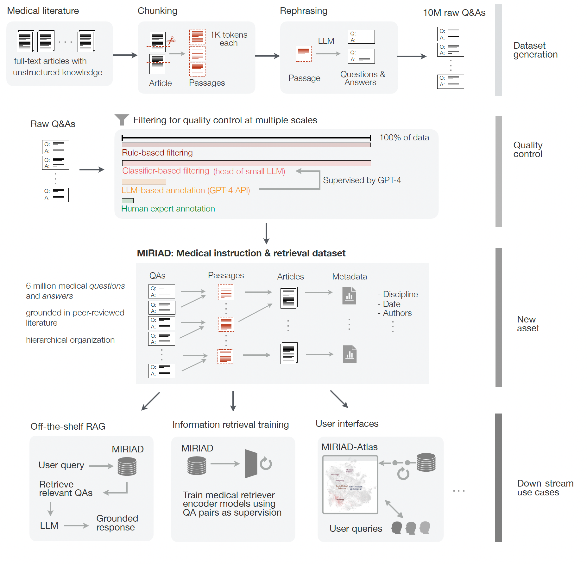

<h2 align="center">MIRIAD: Augmenting LLMs with millions of medical query-response pairs</h2>

<p align="center">
  <a href="https://huggingface.co/papers/2506.06091" target="_blank"></a>
  <a href="https://med-miriad.github.io/" target="_blank"></a>
  <a href="https://huggingface.co/miriad" target="_blank"></a>
  <a href="https://med-miriad.github.io/demo/" target="_blank"></a>

</p>

<p align="center">
  <a href="https://www.linkedin.com/in/qinyue-zheng-526b391a4" target="_blank">Qinyue Zheng</a><sup>1&dagger;</sup>, <a href="https://www.salmanabdullah.com/" target="_blank">Salman Abdullah</a><sup>2&dagger;</sup>, <a href="https://samrawal.com/">Sam Rawal MD</a><sup>3</sup>, <a href="https://cyrilzakka.github.io/" target="_blank">Cyril Zakka MD</a><sup>4</sup>, <a href="https://profiles.stanford.edu/sophie-ostmeier" target="_blank">Sophie Ostmeier MD</a><sup>2,5</sup>, <a href="https://www.linkedin.com/in/maximilian-purk-a87978235" target="_blank">Maximilian Purk MD</a><sup>6</sup>, <a href="https://www.linkedin.com/in/edreismd/" target="_blank">Eduardo Reis MD</a><sup>7</sup>, <br><a href="https://www.scripps.edu/faculty/topol/" target="_blank">Eric Topol MD</a><sup>8</sup>, <a href="https://cs.stanford.edu/people/jure/" target="_blank">Jure Leskovec PhD</a><sup>2</sup>, <a href="https://michaelmoor.me/" target="_blank">Michael Moor MD, PhD</a><sup>1</sup>
  <p align="center"><sup>1</sup>Department of Biosystems Science and Engineering, ETH Zurich, Basel, Switzerland
  <sup>2</sup>Department of Computer Science, Stanford University, Stanford, CA, USA
  <sup>3</sup>Department of Internal Medicine, Mayo Clinic, Phoenix, AZ, USA
  <sup>4</sup>Hugging Face, Manhattan, New York City, NY, USA
  <sup>5</sup>Department of Radiology, Stanford University, Stanford, CA, USA
  <sup>6</sup>Hasso-Plattner-Institute for Digital Engineering, University of Potsdam, Potsdam, Germany
  <sup>7</sup>Center for Artificial Intelligence in Medicine and Imaging, Stanford University, Stanford, CA, USA
  <sup>8</sup>Scripps Translational Science Institute, San Diego, CA, USA
  </p>
</p>

> **TL;DR:** Million-scale medical query-response pairs, which are grounded by peer-reviewed biomedical literature, enable diverse downstream tasks and enhance knowledge reliability of LLMs.

<p align="center"></p>

## Contents

- [Overview](#overview)
- [Repo Contents](#repo-contents)
- [System Requirements](#system-requirements)
- [Installation Guide](#installation-guide)
- [Demo](#demo)
- [Instruction for use](#instruction-for-use)

### To load the dataset, run:
```python
from datasets import load_dataset

dataset = load_dataset("miriad/miriad-5.8M", split="train") # for the 5.8M version
```
<!-- If you don't have access to the Huggingface dataset yet, no worries. We've prepared the dataset on [Google Drive](https://drive.google.com/file/d/1BPmHR83PvSEQIFlwkyblH0wb0eNRum8a/view?usp=sharing) for smooth access. We've also prepared an instruction on how to access the dataset vis Google drive in `demo/playbook.ipynb`. Feel free to download and try it out.  -->
or 
```python
from datasets import load_dataset

dataset = load_dataset("miriad/miriad-4.4M", split="train") # for the 4.4M version
```

# Overview

**MIRIAD** is a *large-scale, curated corpus of 5,821,948 medical instruction–response pairs*, each grounded in peer-reviewed literature. Generated via a semi-automated pipeline combining LLM rewriting, grounding, filtering and expert annotation, MIRIAD operationalizes medical knowledge in a format that LLMs can reliably use. MIRIAD boosts accuracy in medical question answering, enables the *detection of medical hallucinations*, and can support clinical users via *MIRIAD-Atlas*, a visual interface for semantically organized browsing and knowledge retrieval. MIRIAD lays the groundwork for safer, more grounded medical AI across clinical care and biomedical research.

# Repo Contents

- [Data Generation](./data_generation): Code scripts used for MIRIAD data generation.
- [Quality Control](./quality_control/): Code scripts used for MIRIAD quality control, including the human expert annotation streamlit app, quality filtering code.
- [RAG Pipeline](./rag_pipeline/): Code scripts used for RAG experiments, and medical hallucination detection experiments.
- [Demo](./demo/): Demo notebook for a quick start, including simple Qdrant Retrieval pipeline with MIRIAD as the external corpus, RAG on MedMCQA with MIRIAD.
- [Discipline Categorization](./discipline_categorization/): the final curated 56 disciplines within MIRIAD.
- [MIRIAD Atlas Vis](https://med-miriad.github.io/demo/): Atlas demo with 300k MIRIAD subset.

# System Requirements

## Hardware Requirements

To run the full pipeline of MIRIAD, including embedding and LLM inference, systems with GPUs are recommended. For example, running the pipeline with Llama 3.1–8B-Instruct requires a minimum of one NVIDIA A100 GPU (40GB) or equivalent. CPU-only systems can be used for basic tasks (e.g., data loading, QA pair inspection), but will be significantly slower and are not suitable for LLM inference or dense embedding generation at scale.

## Software Requirements

Linux-based systems (Ubuntu 22.04) are recommended for best compatibility and performance. Dependencies are specified in the provided `requirements.txt` with Python 3.10.12. The full environment can be installed via `pip` in a Python virtual environment. On a typical desktop with a stable internet connection, installation takes approximately 5-10 minutes.

# Installation Guide

## Clone and set up environment

 ```bash
git clone https://github.com/eth-medical-ai-lab/MIRIAD.git
cd rag-pipeline

python3 -m venv env
source .venv/bin/activate
pip install -r requirements.txt
```

# Demo

To facilitate reproducibility and intuitive exploration, we provide a demo notebook, which can be found as `demo/playbook.ipynb`. The notebook includes the following subsections:
- MIRIAD Dataset Loading
- RAG Pipeline
- Demo for the retrieval results 
- Demo for solving 500 questions from MedMCQA with the aid of MIRIAD
- Demo for MIRIAD Atlas

#### Lightweight RAG demo
In the notebook we showcase how MIRIAD can be used as an external knowledge source in a RAG pipeline. The notebook runs a lightweight benchmark using 500 random questions from the MedMCQA dataset. For each question, the top-k relevant QA pairs are retrieved from MIRIAD and concatenated with the prompt to a language model. The final output includes the predicted answers and an aggregated accuracy score. This demo can be executed on a single GPU. To run the notebook, please make sure to set up the [qdrant vector database](#docker-and-qdrant-vector-database-setup) first.

#### MIRIAD Altas demo
To support visual inspection and exploration, we also provide a static HTML demo—MIRIAD Atlas that allows users to browse the structured medical QA pairs. The HTML file can be downloaded from [Google Drive](https://drive.google.com/file/d/1Lga6mxD6yTTi1gVDvtqRPlwnTtn8_hGD/view?usp=drive_link) and opened locally in any modern web browser. It supports keyword search, topic filtering, and exploration of discipline clusters.

# Instruction for use

See [Data Generation](./data_generation/) and [Quality Control](./quality_control/) for MIRIAD Dataset Creation.

To directly use the off-the-shelf MIRIAD Dataset, quick start:

## Docker and Qdrant Vector Database setup
### Step 1: Install Docker Engine on Ubuntu. 
- Feel free to skip this step if you already have docker running on your machine
- For more detailed information, checkout the official [dockerdocs](https://docs.docker.com/engine/install/ubuntu/)
#### 1. Uninstall old versions to prevent conflictions
```bash
for pkg in docker.io docker-doc docker-compose docker-compose-v2 podman-docker containerd runc; do sudo apt-get remove $pkg; done
```
#### 2. Set up Docker's `apt` repository
```bash
# Add Docker's official GPG key:
sudo apt-get update
sudo apt-get install ca-certificates curl
sudo install -m 0755 -d /etc/apt/keyrings
sudo curl -fsSL https://download.docker.com/linux/ubuntu/gpg -o /etc/apt/keyrings/docker.asc
sudo chmod a+r /etc/apt/keyrings/docker.asc

# Add the repository to Apt sources:
echo \
  "deb [arch=$(dpkg --print-architecture) signed-by=/etc/apt/keyrings/docker.asc] https://download.docker.com/linux/ubuntu \
  $(. /etc/os-release && echo "${UBUNTU_CODENAME:-$VERSION_CODENAME}") stable" | \
  sudo tee /etc/apt/sources.list.d/docker.list > /dev/null
sudo apt-get update
```
#### 3. Install the Docker packages
```bash
sudo apt-get install docker-ce docker-ce-cli containerd.io docker-buildx-plugin docker-compose-plugin
```

#### 4. Verify that the installation is successful by running the `hello-world` image
```bash
sudo docker run hello-world
```

### Step 2: Setup Qdrant database image
- Feel free to skip this step if you already have qdrant image running.
- For more detailed information, we encourage you to checkout [qdrant documentations](https://qdrant.tech/documentation/quickstart/).
#### 1. Download the latest Qdrant image from Dockerhub
```bash
sudo docker pull qdrant/qdrant
```
#### 2. Then, run the service:
```bash
sudo docker run -p 6333:6333 -p 6334:6334 \
    -v "$(pwd)/qdrant_storage:/qdrant/storage:z" \
    qdrant/qdrant
```
Now you have qdrant image set up.

### Step 3: Prepare MIRIAD Index in Qdrant for later retrieval-augmentation generation (RAG)
#### Quickstart
Clone + set up environment
 ```bash
git clone https://github.com/eth-medical-ai-lab/MIRIAD.git

python3 -m venv env
source .venv/bin/activate
pip install -r requirements.txt
```
#### Embed Dataset and Build Qdrant Vector Database
1. Embedding parameters are recorded in `config.yaml`. Tune to specify MIRIAD dataset version, embedding model, batch size etc.
2. Install and run Qdrant database with `./qdrant.sh`. Make sure to change the `/local1/qdrant/miriad/qdrant_storage` to your local directory before starting the new container. Feel free to skip this step if you've already had qdrant running.
3. Run `python distributed_embedding_db.py` to embed MIRIAD. Given the scale of MIRIAD, we recommend to have at least 1 GPU for faster embedding. Change `world_size` in `config.yaml` accordingly based on the number of GPUs you use.
4. Run `./upsert_embeddings.sh` to upload the embeddings to local qdrant database
4. See `demo/playbook.ipynb` for examples of performing RAG with Qdrant.

## RAG Pipeline Overview
- RAG Experiments on Medical Question-Answering benchmarks
- RAG Experiments on Hallucination Detection benchmark

End to end pipeline:
1. Embed MIRIAD dataset, and setup vector database for efficient storage and retrieval
    - Can do "qa", "passage_text", "question" only or "answer" only embeddings
    - Supports any huggingface embedding models, including sentenct-transformers, BAAI/bge etc.

2. Evaluate on various QA benchmark datasets via `run_evaluation` script. Pass in arguments:
    - dataset + split (e.g. [medmcqa, dev])
    - `in_context_mode` True or False indicates whether to use retrieval-augmented-generation or not
    - top_k parameter (if in_context_mode is True)
    - Further configurations can be tuned in `eval_config.yaml` to specify world_size, embedding model, backbone llm etc. Supports commercial API calls or huggingface for local moddels

#### Run Evaluation
Run evaluation as follows:
```bash
python run_evaluation.py
```

#### Results
To ensure better reproducibility, we provide a notebook at `rag_pipeline/log_results_checking.ipynb` for you to quickly checkout your own experiment results.


## 📖 Citation

Hope you find this project helpful! Kindly cite our paper at

```bibtex
@misc{zheng2025miriadaugmentingllmsmillions,
      title={MIRIAD: Augmenting LLMs with millions of medical query-response pairs}, 
      author={Qinyue Zheng and Salman Abdullah and Sam Rawal and Cyril Zakka and Sophie Ostmeier and Maximilian Purk and Eduardo Reis and Eric J. Topol and Jure Leskovec and Michael Moor},
      year={2025},
      eprint={2506.06091},
      archivePrefix={arXiv},
      primaryClass={cs.CL},
      url={https://arxiv.org/abs/2506.06091}, 
}
```